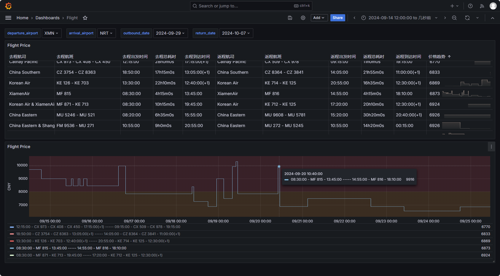

# Flight Metrics

A flight price metrics monitor exporting by prometheus.

## Grafana Dashboard



[grafana-dashboard.json](./configs/grafana-dashboard.json)

## Usage

### Configure the monitoring flights

Config file example:

> The default config file is `configs/config.yml`.
> You can modify it by yourself.

```yaml
currency: CNY
lang: zh-cn
flights:
  - cron: '43 * * * *' # See https://crontab.guru/ for more details
    outboundDate: 2024-09-28
    returnDate: 2024-10-07
    departureAirport: 'XMN'
    arrivalAirport: 'NRT'
```

### Run with docker

```sh
docker run -d \
    --name flight-metrics \
    -p 2112:2112 \
    -v ${PWD}/configs:/configs \
    gitsang/flight-metrics:latest \
        -c /configs/config.yml
```

## Metrics

```
flight_google_round_trip{
    departure_airport="XMN",
    arrival_airport="NRT",

    outbound_date="2024-09-30",
    outbound_airline_name="EVA Air & XiamenAir",
    outbound_departure_time="12:55:00",
    outbound_duration="21h50m0s",
    outbound_arrival_time="11:45:00(+1)",

    return_date="2024-10-06",
    return_airline_name="Cathay Pacific & EVA Air",
    return_departure_time="14:25:00",
    return_duration="21h40m0s",
    return_arrival_time="11:05:00(+1)",
} 6974
```
